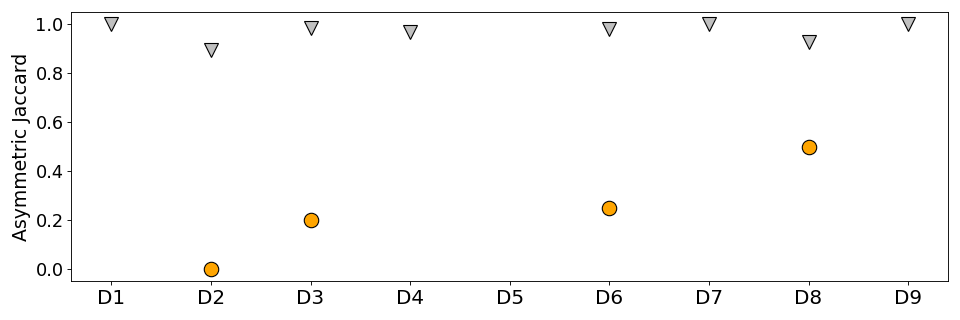
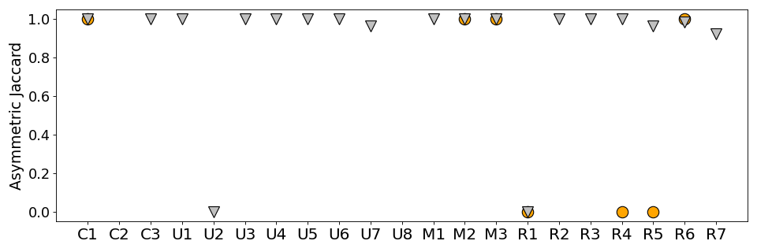

As the variance of AJ values of the generated patches are too small to be presented as boxplots, we plot a mean of them.

The silver triangles show the AJ values of HPO and Random's patches,
and yellow circles show the AJ values of AutoTrainer's.

Note that there are missing triangles and circles as we only consider statistically significant patches.

### AJ values of real faults

### AJ values of artificial faults

